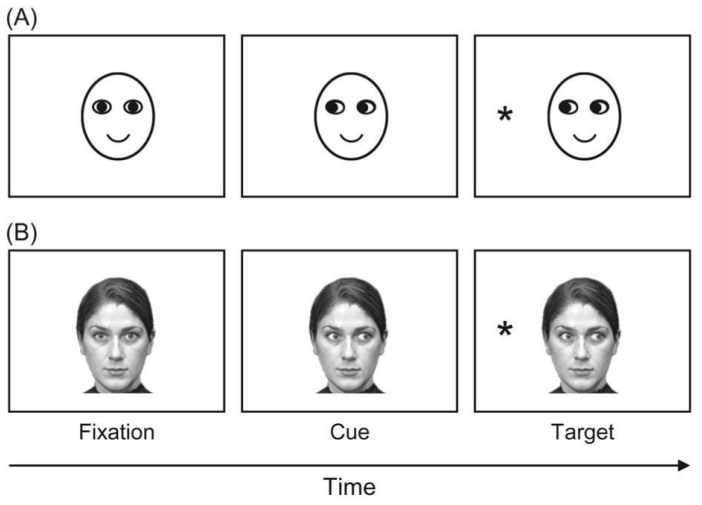

```{r setup, include=FALSE}
options(htmltools.dir.version = FALSE)
```
# Gaze cueing


---

# Gaze cueing



???

aus: Frischen, A., Bayliss, A. P., & Tipper, S. P. (2007). Gaze cueing of attention: visual attention, social cognition, and individual differences. Psychological bulletin, 133(4), 694.

---
class: center, middle

# Eine Meta Analyse in 6 Schritten

 ---

--

##  1. Do a literature search

--

##  2. Decide on inclusion criteria

--

##  3. Calculate the effect sizes

--

##  4. Do the basic meta-analysis

--

##  5. Do some more advanced analysis

--

## 6. Write it up

???

aus: Field, Andy P., and Raphael Gillett. 2010. “How to Do a Meta-Analysis.” British Journal of Mathematical and Statistical Psychology 63 (3). Wiley-Blackwell: 665–94. [doi:10.1348/000711010x502733](https://onlinelibrary.wiley.com/doi/abs/10.1348/000711010X502733).

---

##  1. Do a literature search

+   Keyword Suche in [ISI Web of Knowledge](https://www.webofknowledge.com/?), [PubMed](https://www.ncbi.nlm.nih.gov/pubmed), [PSYNDEX](https://www.ebsco.com/products/research-databases/psyndex), [PsycARTICLES](https://www.apa.org/pubs/databases/psycarticles/index.aspx) & [PsycINFO](https://www.apa.org/pubs/databases/psycinfo/index.aspx) ergab **1202** Treffer
    >   ( "gaze cueing" ) OR ( "gaze cuing") OR ( "face perception" AND (cueing OR cuing) AND attention ) OR ( "gaze perception" AND (cueing OR cuing) AND attention ) OR ( "posner cueing" AND attention AND ( gaze OR face OR social OR joint ) ) OR ( "spatial cueing" AND attention AND ( gaze OR face OR social OR joint ) ) OR ( attention AND (gaze OR face) AND (orienting OR orientation OR following) and reflexive )

--

+   Nach Ausschluss von (offensichtlichen) Duplikaten noch **674** Treffer

--

+   Nach Ausschluss Anhand der Exklusionskriterien noch **293** Treffer

???

Datenbankanbieter Ebsco, ProQuest


---

##  2. Decide on inclusion criteria

+   Nach Anwendung der Inklusionskriterien werden **71** Studien inkludiert

    +   falls vollständig, bzw. fehlende Information vorhanden

    `r icon::fa_plus()` unpublizierte Studien/ Daten von *Top-Authoren*

+   Kontakt zu ~55 Authoren (inkl. *Top-Authoren*)
    +   von 7 Studien keine Kontaktmöglichkeit zu den Authoren
    +   Deadline für Inklusion von Daten ist der 15.11.2018


---

##  3. Calculate the effect sizes

+   Stand heute: Aus **50** Experimenten (aus **28** Studien) ergeben sich **131** vollständige Beobachtungen

--

+   Effektstärke: *raw mean difference* 

$$RT_{invalide} - RT_{valide} = MD$$

.pull-right[

<iframe src="https://giphy.com/embed/y3QOvy7xxMwKI" width="480" height="383" frameBorder="0" class="giphy-embed" allowFullScreen></iframe>

]

???

Many psychological variables are measured in different ways by different researchers. To cumulate knowledge about such variables, meta-analysts must somehow standardize research results. They have done so by adopting an effect-size measure that divides a result by an observed standard deviation.

---

##  4. Do the basic meta-analysis

### Random-Effects Models

>   1. Does a stream of research produce heterogeneous results?
>   2. If so, how large is this variation?
>   3. How can we make valid inferences about the average effect size when the true effect sizes vary?
>   4. Why do study effects vary?
>   5. How effective are such models in accounting for effect size variation?
>   6. Given that the effect sizes do indeed vary, what is the best estimate of the effect in each study?

???

A central aspect of statistical inference is making a generalization from an observed sample to a larger population or universe of generalization

1.: That is, do the true effect sizes vary?

4.:  Specifically do observable differences between studies in their target populations, measurement approaches, definitions of the treatment, or historical contexts systematically predict the effect sizes?

5.: Specifically, how much variation in the true effect sizes does each model explain?


--

.pull-left[

#### Classical

+   random variation of the true effect sizes represents **a random sample from a larger population of studies**

]

.pull-right[

#### Baysian

+   random variation of the true effect sizes represents **the investigator’s lack of knowledge about the process that generates them**

]

???

method = DerSimonian-Laird estimator, Hedges estimator, Hunter-Schmidt estimator, Sidik-Jonkman estimator, maximum-likelihood estimator, restricted maximum-likelihood estimator, ...

aus: Cooper, H., Hedges, L. V., & Valentine, J. C. (Eds.). (2009). The handbook of research synthesis and meta-analysis. Russell Sage Foundation.

---

##  5. Do some more advanced analysis

+   Moderatoren
    +   *cue type*, *stimulus type*, *soa*, *emotion*, *sex*, *age*, *task type*, *remaining*

--

+   keine unabhängige Stichproben!
    +   Viele Moderatoren sind *within* manipuliert  
    `r icon::fa_arrow_right()` [Modell auf Robustheit testen](https://wviechtb.github.io/metafor/reference/robust.html) oder [direkt *robust* fitten](https://cran.r-project.org/web/packages/robumeta/robumeta.pdf)

???

+   covariance structure of the dependent estimates unkown

--

+    Identifying Publication Bias
    +   bspw. Funnel-Plots

+   Assessing Impact of Publication Bias
    +   bspw. Fail Safe N 

---

## 6. Write it up

.center[

<iframe src="https://giphy.com/embed/JIX9t2j0ZTN9S" width="480" height="480" frameBorder="0" class="giphy-embed" allowFullScreen></iframe>

]

---
class: center, middle

# Eine Meta Analyse in 6 Schritten

 ---

##  1. Do a literature search

##  2. Decide on inclusion criteria

##  **3. Calculate the effect sizes**

##  4. Do the basic meta-analysis

##  5. Do some more advanced analysis

##  6. Write it up

???

aus: Field, Andy P., and Raphael Gillett. 2010. “How to Do a Meta-Analysis.” British Journal of Mathematical and Statistical Psychology 63 (3). Wiley-Blackwell: 665–94. [doi:10.1348/000711010x502733](https://onlinelibrary.wiley.com/doi/abs/10.1348/000711010X502733).


---

class: inverse, center, middle

# Vielen Dank für Eure Aufmerksamkeit!

`r icon::fa_smile(size = 5, color = "yellow")`


.footnote[

<font size="-2">Slides created via the R packages [**xaringan**](https://github.com/yihui/xaringan) and [knitr](http://yihui.name/knitr), and [R Markdown](https://rmarkdown.rstudio.com). </font size>

]

---

# Quellen

Bond Jr, C. F., Wiitala, W. L., & Richard, F. D. (2003). Meta-analysis of raw mean differences. Psychological Methods, 8(4), 406.

Frischen, A., Bayliss, A. P., & Tipper, S. P. (2007). Gaze cueing of attention: visual attention, social cognition, and individual differences. Psychological bulletin, 133(4), 694.

Cooper, H., Hedges, L. V., & Valentine, J. C. (Eds.). (2009). The handbook of research synthesis and meta-analysis. Russell Sage Foundation.

Field, Andy P., and Raphael Gillett. 2010. “How to Do a Meta-Analysis.” British Journal of Mathematical and Statistical Psychology 63 (3). Wiley-Blackwell: 665–94.

Hedges, L. V., Tipton, E., & Johnson, M. C. (2010). Robust variance estimation in meta-regression with dependent effect size estimates. Research Synthesis Methods, 1, 39--65.

Viechtbauer, W. (2010). Conducting meta-analyses in R with the metafor package. Journal of statistical software, 36(3).