```{r setup, include=FALSE}

options(htmltools.dir.version = FALSE )

```

## my web dev background

--

.pull-left[

### `r icon::fa_frown()`

+   I know nothing about **CSS**
+   I know nothing about **HTML**

]

--

.pull-right[

### `r icon::fa_smile()`

+   I know **nothing** about CSS
+   I know **nothing** about HTML

]

--

.center[

### but

https://practical-wilson-39bf22.netlify.com/

]

---

## Today

--

+   teach nothing about *CSS*, *HTML*

--

+   talk as little as possible about *R*

--

+   prepare the basic setup

--

+   offer an overview

---
class: inverse, middle, center

# Requirements

---
background-image: url(https://cran.r-project.org/Rlogo.svg)
background-size: 300px 300px

---
background-image: url(https://cran.r-project.org/Rlogo.svg)
background-size: 100px 100px
background-position: 96% 3%

## open R(Studio)

--

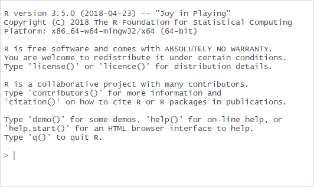

---
background-image: url(https://db.yihui.name/images/hex-blogdown.png)
background-size: 300px 300px

---
background-image: url(https://db.yihui.name/images/hex-blogdown.png)
background-size: 100px 100px
background-position: 96% 3%

## install blogdown

```{r eval=FALSE, tidy=FALSE}

install.packages("blogdown")

```

--

### errors?

--

```{r eval=FALSE, tidy=FALSE}

install.packages("missing-package")

```

--

and try again:

```{r eval=FALSE, tidy=FALSE}

install.packages("blogdown")

```

--

##blogdown installed!

---
background-image: url(https://gohugo.io/img/hugo.png)
background-size: 300px 300px

---
background-image: url(https://gohugo.io/img/hugo.png)
background-size: 100px 100px
background-position: 96% 3%

## install HUGO

```{r eval=FALSE, tidy=FALSE}

blogdown::install_hugo()

```

--

##HUGO installed

---
background-image: url(http://cliparts.co/cliparts/rcL/n4q/rcLn4qBAi.png)
background-size: 300px 300px

# Requirements

---
class: inverse, center, middle

# website

--

## 1) build

--

## 2) modify

--

## 3) publish

---

## 1) build website

.pull-left[

#### RStudio

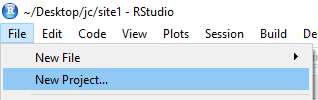

]

---

## 1) build website

.pull-left[

#### RStudio

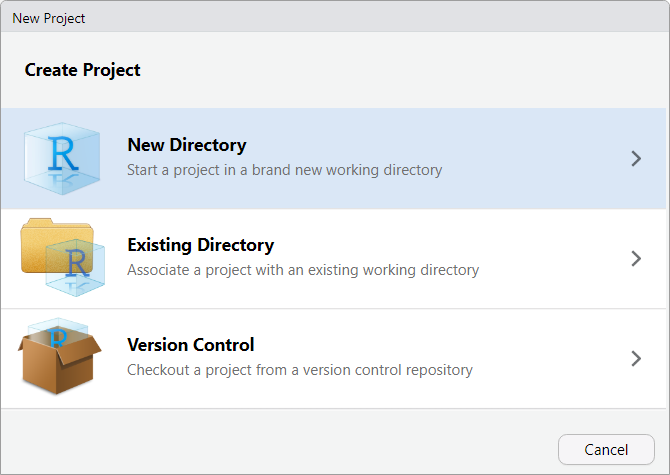

]

---

## 1) build website

.pull-left[

#### RStudio

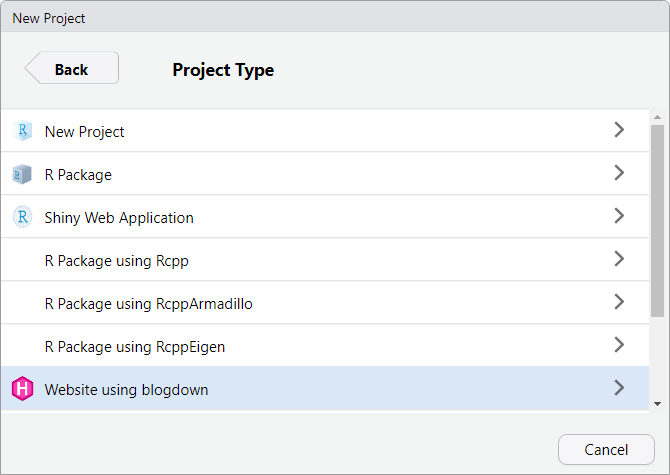

]

---

## 1) build website

.pull-left[

#### RStudio

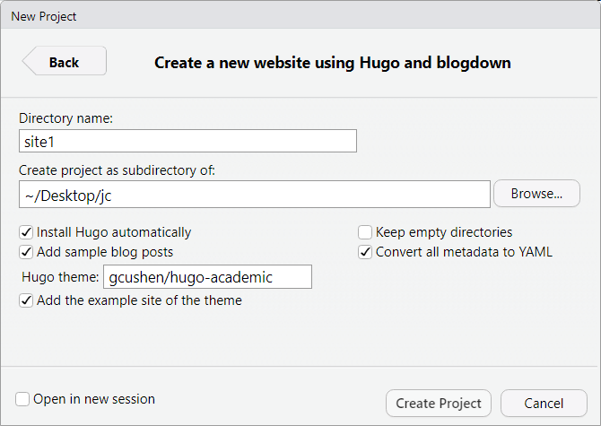

]

.pull-right[

#### Console

```{r eval=FALSE}

setwd('~/Desktop/jc')

blogdown::new_site(
  dir = 'site1',
  theme = 'gcushen/hugo-academic',
  install_hugo = TRUE,
  sample = TRUE,
  theme_example = TRUE,
  to_yaml = TRUE)

```

`r icon::fa_exclamation_triangle()`  **Does not create a project**

]

--

.bottom[

more *Hugo themes* can be found at https://themes.gohugo.io/

]

---

## 1) build website

.pull-left[

#### RStudio

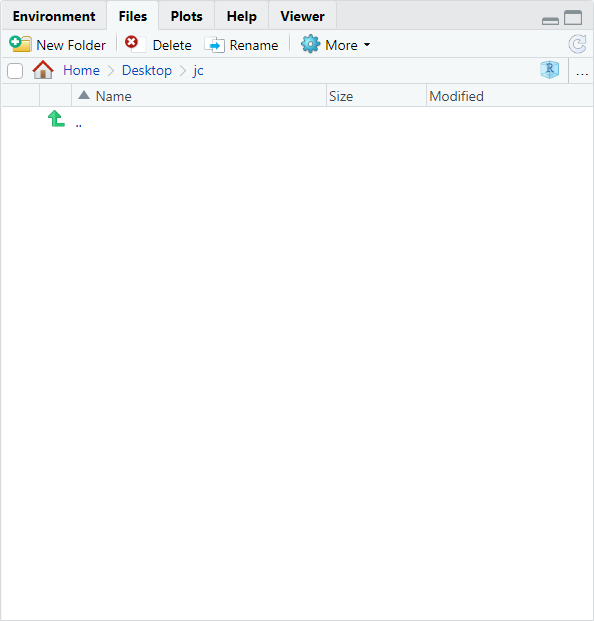

]

.pull-right[

#### File explorer

DIY

]
---

## 1) build website

.pull-left[

#### RStudio

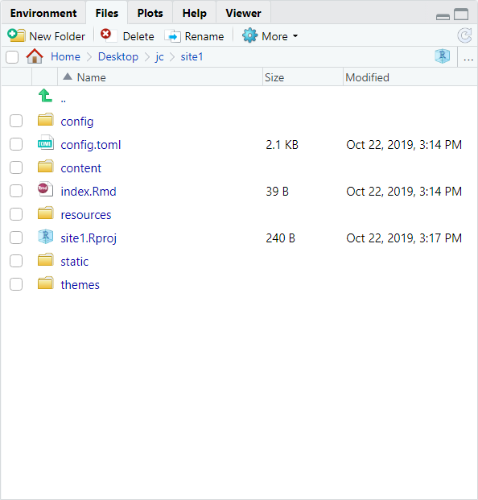

]

.pull-right[

#### File explorer

DIY

]
---

## 1) build website

.pull-left[

#### RStudio

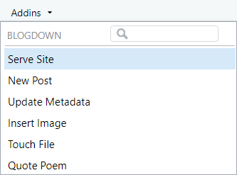

]

.pull-right[

#### Console

```{r eval=FALSE, tidy=TRUE}

blogdown::serve_site()

```

]

---

## 1) build website

` Serving the directory C:\Users\jog54yy\Desktop\jc\site1 at
http://127.0.0.1:6868 `

--

.pull-left[

#### RStudio

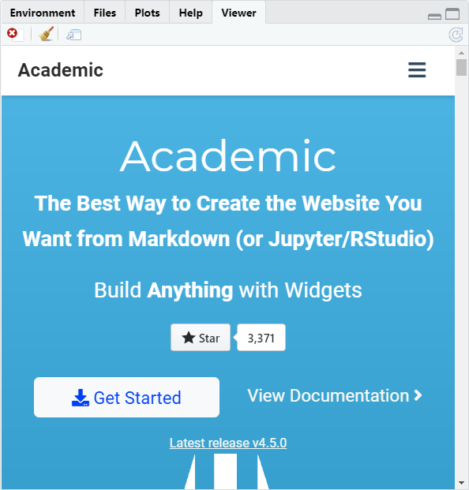

]

.pull-right[

#### Browser

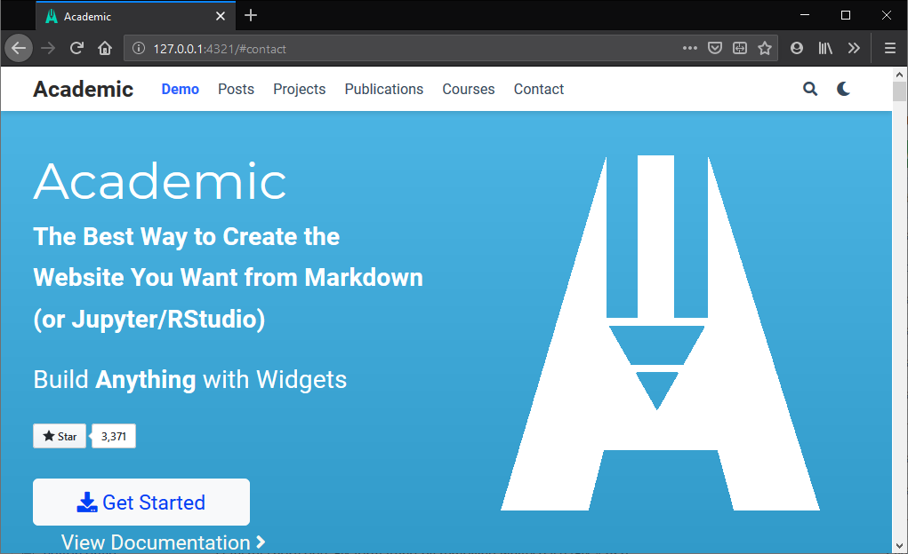

]


---

## 1) build website

.pull-left[

#### RStudio

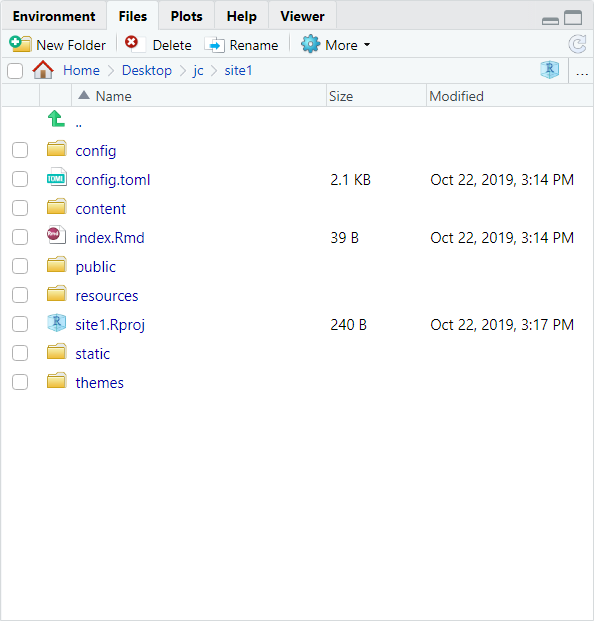

]

.pull-right[

#### File explorer

DIY

]

---
background-image: url(http://cliparts.co/cliparts/rcL/n4q/rcLn4qBAi.png)
background-size: 300px 300px

# website built

---

## 2) modify website

.pull-left[


]

.pull-right[

0.   config.toml
0.   content/
0.   static/
0.   themes/

]

--

Documentation for the *academic* theme at: https://sourcethemes.com/academic/

---

## 2) modify website

### config.toml

.pull-left[


```toml
# Configuration of Academic
# Documentation: https://sourcethemes.com/academic/
#
# This file is formatted using TOML syntax - learn more at https://learnxinyminutes.com/docs/toml/
# Each configuration section is defined by a name in square brackets (e.g. `[outputs]`).

# Title of your site
title = "Academic"

# The URL of your site.
# End your URL with a `/` trailing slash, e.g. `https://example.com/`.
baseurl = "/"

# Enter a copyright notice to display in the site footer.
# To display a copyright symbol, type `&copy;`. For current year, type `{year}`.
copyright = ""

############################

```

]

.pull-right[

```toml
# Configuration of Academic
# Documentation: https://sourcethemes.com/academic/
#
# This file is formatted using TOML syntax - learn more at https://learnxinyminutes.com/docs/toml/
# Each configuration section is defined by a name in square brackets (e.g. `[outputs]`).

# Title of your site
title = "This is actually personalized!"

# The URL of your site.
# End your URL with a `/` trailing slash, e.g. `https://example.com/`.
baseurl = "/"

# Enter a copyright notice to display in the site footer.
# To display a copyright symbol, type `&copy;`. For current year, type `{year}`.
copyright = ""

############################

```

]

---

## 2) modify website

### content/

.pull-left[

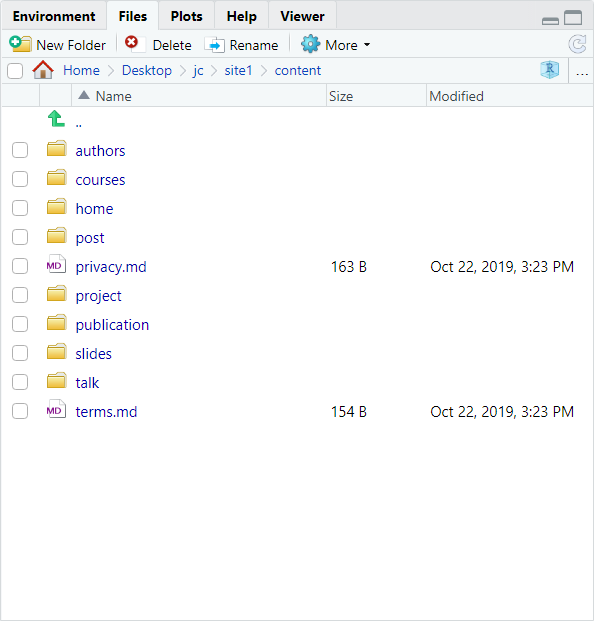

]

--

.pull-right[

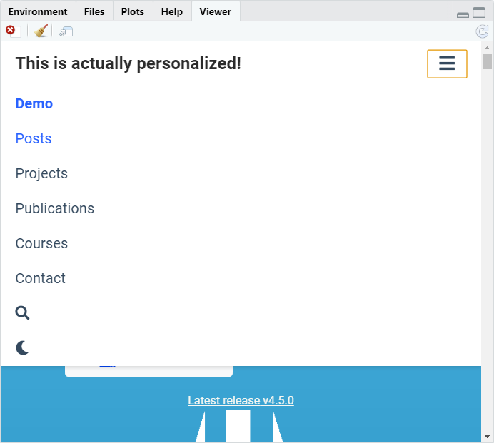

]

---

## 2) modify website

### content/

.pull-left[


]

.pull-right[

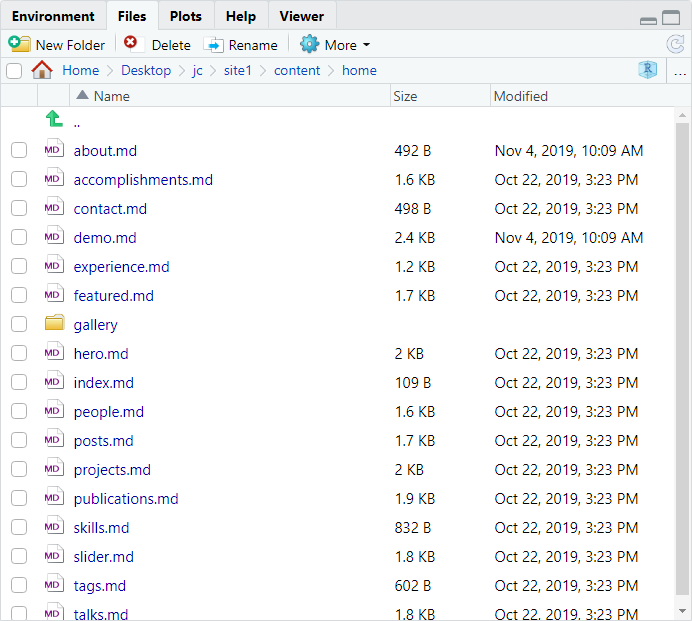

]

---

## 2) modify website

### static/
---

## 2) modify website

### themes/

---
background-image: url(http://cliparts.co/cliparts/rcL/n4q/rcLn4qBAi.png)
background-size: 300px 300px

# website modified!

---
background-image: url(https://www.netlify.com/img/global/favicon/apple-touch-icon.png)
background-size: 300px 300px

---
background-image: url(https://www.netlify.com/img/global/favicon/apple-touch-icon.png)
background-size: 100px 100px
background-position: 96% 3%

## 3) publish website

--

### make a netlify account

Go to [netlify.com](https://app.netlify.com/signup) and sign-up

--

### drag & drop the folder *public*

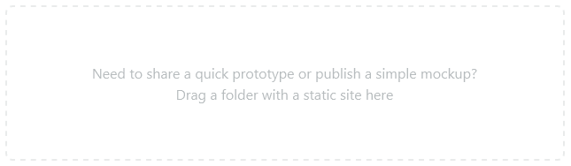

For updates go to *Deploys* and drag & drop *public* folder

---
background-image: url(http://cliparts.co/cliparts/rcL/n4q/rcLn4qBAi.png)
background-size: 300px 300px

# website published

---
class: inverse, middle, center

# That's it!

---
class: bottom, center
background-image: url(https://bookdown.org/yihui/blogdown/images/cover.png)
background-size: 275px 400px

## https://bookdown.org/yihui/blogdown/

---
class: inverse

# open topics

+   Blogposts verfassen
+   GitHub Integration
+   Eigene Domain nutzen
+   Integration mit GitHub-Pages

---

## Theme anpassen

---

## Blogpost verfassen

---
background-image: url(https://github.com/fluidicon.png)
background-size: 100px 100px
background-position: 96% 3%

## GitHub Integration

+ GitHub Account erstellen
+ Netlify zugriff auf das Respository gewähren
    + Netlify kann die Seite mit einer eigenen HUGO-*Engine* generieren, oder
    + Seite lokal generieren (wie wir es eben getan haben)
+ GitHub *push* löst *Deployment* auf Netlify aus.

---

## Eigene Domain nutzen

---

## Integration mit GitHub-Pages
